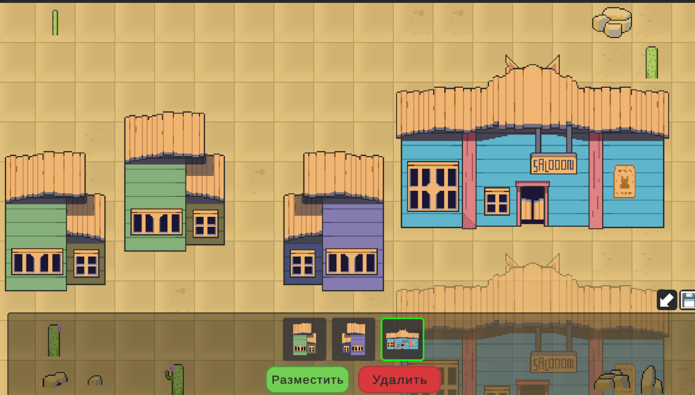

Разбил приложение на слои:
* Domain - бизнес модели (без Unity Reference)
* Usecases - бизнес логика и интерфейсы
* Infrastrusture - реализацию внешних зависимостей и сервисов
* Presentation - MVP слой
-------
Стек: Zenject + MessagePipe, Addressables, UniTask

* Addressables - загрузка / выгрузка ресурсов
* Zenject - внедрение зависимостей между слоями
* MessagePipe - система событий между слоями
* UniTask для парочки асинхронных методов и для методов загрузки Addressables
* Окно конфига сделал с помошью Odin Inspector
-------
В целом старался делать все через абстракции с закосом на дальнейшую разработку, модульность и тестируемость.
